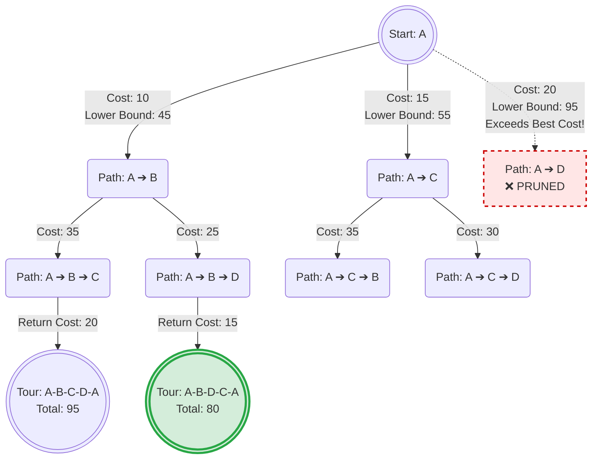

To make your diagrams perfectly compatible with Markdown previews (like GitHub, VS Code, or Obsidian) and seamlessly convertible via Pandoc, the absolute best tool is **Mermaid.js**.

Mermaid allows you to generate flowcharts, state-space trees, and sequence diagrams using plain text directly inside your `.md` files.

### The Mermaid Diagram

Copy and paste this exactly as it appears into your Markdown file. Notice that it uses `mermaid` as the language tag for the code block:



### How to process this with Pandoc

To get Pandoc to convert this text block into a beautiful image in your final PDF, you need to use a **Pandoc Filter**.

1. **Install the filter:** The most common one for Node.js users is `mermaid-filter`.

   ```bash
   npm install --global mermaid-filter
   ```

2. **Update your Pandoc Command:** Add the `--filter` flag to your existing workflow.

   ```bash
   pandoc 424ma5005_assignment_5.md -o 424ma5005_assignment_5.pdf \
   --pdf-engine=pdflatex \
   --number-sections \
   --toc \
   --listings \
   --filter mermaid-filter
   ```
